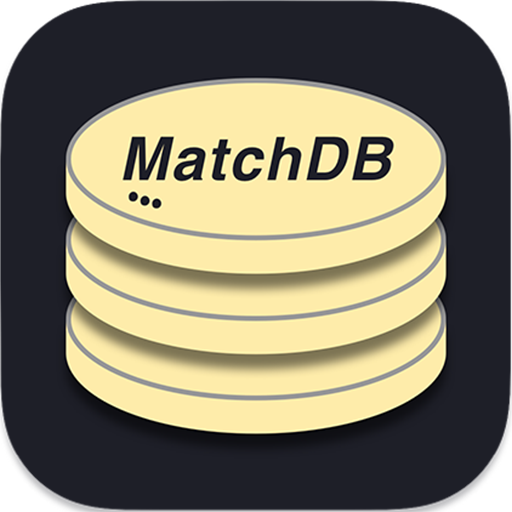

#  MatchDB（BETA）

* Author:MatchOvO

[MachDB](): 基于Node.JS开发的一套简单易用轻量化的且独立运行的数据库系统

#### MatchDB is built with the following technologies:
* [NodeJS](https://nodejs.org/en/) 
* [Express](https://www.expressjs.com.cn)

MatchDB相比大型数据库系统（MySQL等）安装和配置极其简单，也极其的轻量化，对数据表文件的顺序读写在一定数据量以内性能也更加的高效
对比起其他一些单纯对文件的读写进行封装的包不同，MatchDB集后端接口和可视化操作为一体，通过访问[MatchDB Workbench]()（开发中）即可对数据库进行可视化的操作和查询
底层数据文件存储不只是简单的对象数据存储，MatchDB设计了一套高效的数据存储方式和结构，并且为每个数据都设计有索引，查询数据的时候相比简单的数据文本存储可以更加的高效
未来计划加入sql语句的解析系统（开发中）
设计的初衷就是让MatchDB在更加易用更加轻量化的体验下，让整体的体验更接近大型数据库的使用体验，目标定位[中小型项目]()的开发，大型项目的开发效果有待正式版开发完成后压力测试的结果

此外MatchDB设计有安全策略，哪怕直接对外暴露数据库端口，也能尽量保障数据的安全性

MatchDB不同于一般对于文件读写的封装，MatchDB是一个独占一个端口的独立运行的数据库系统，未来会上线一个如同对MySQL，MongoDB进行数据库连接和操作的npm包，供开发者在项目中进行使用

目前上线的BETA版本中，完成了基本的API接口，可以查看[API文档](./Docs/APIs%20Document.md)

感谢你对于开源项目的支持！

 
